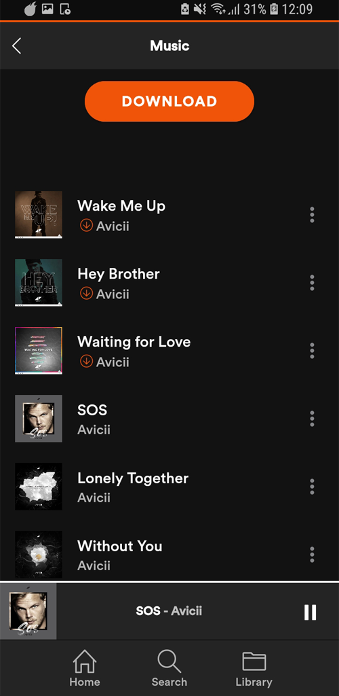

  

   <a style="font-size: 29px">Firefly Music App</a>

 
 
  

   <a style="font-size: 29px">About/Status</a>

  Firefly is a free music streaming and downloading app
  which uses the Genius API to collect information about
  songs and also uses this information to find the songs
  on youtube.
  It supports online and offline streaming and already heard
  songs get cached automatically. Also it supports off-screen
  playback. Under the hood it uses python to download youtube 
  videos and to convert it to mp3.
  Download and streaming currently broken due to youtubes
  ongoing effort to block downloader (and outdated libs) ❌

 
 

   <a style="font-size: 29px">Screenshots</a>

  

 
 

